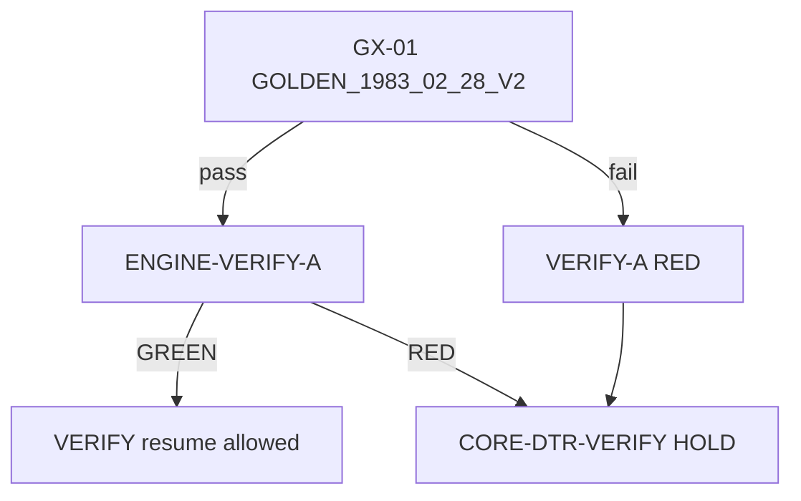

# Phase 5-6H-5Z-I-V-ENGINE-SPEC-C-R — 1983-02-28 golden anchor and snapshot firewall reinforcement gate（2026-05-21 SSOT）

## A. Gate summary

| Field | Value |
|-------|--------|
| **Phase** | **5Z-I-V-ENGINE-SPEC-C-R** |
| **Title** | **1983-02-28 golden anchor and snapshot firewall reinforcement** |
| **Classification** | **Category 1 / golden anchor + regression firewall SSOT / docs-only / no-mutation** |
| **Verdict** | **`GOLDEN_ANCHOR_1983_02_28_AND_SNAPSHOT_FIREWALL_REINFORCEMENT_GREEN_NO_MUTATION`** |
| **Evidence ID** | **`M55-EVID-20260521-5Z-I-V-ENGINE-SPEC-C-R-GOLDEN-ANCHOR-1983-02-28-AND-SNAPSHOT-FIREWALL-REINFORCEMENT-001`** |
| **Date** | **2026-05-21** |
| **Branch** | **`work/home-cluster`** |
| **Prior** | **ENGINE-SPEC-C** — **`GX-01`**；**ENGINE-SPEC-B-R** sign-off |

**Execution:** SSOT reinforcement only.** **No** code / DB / deploy / checkout.

**Effect:** **GX-01** promoted from matrix row to **absolute regression firewall** for v2 composite engine.

---

## B. 1983-02-28 golden anchor（`GOLDEN_1983_02_28_V2` — absolute）

### B1. Input fixture（frozen）

| Field | Value |
|-------|--------|
| **birthDate** | `1983-02-28` |
| **birthTime** | `12:00:00` |
| **birthTimeUnknown** | `false` |
| **country** | `JP` |
| **birthplace** | `東京都` |
| **timezone** | `Asia/Tokyo` |
| **locale** | `ja-JP` |
| **contextScope** | `essence`（`/core`）/ `dtr`（paid path） |

### B2. v2 required output（any deviation = implementation defect）

| Field | **Required value** |
|-------|-------------------|
| **engineVersion** | `m55-composite-stem-v2` |
| **inputVersion** | `composite-input-v1` |
| **correctionVersion** | `m55-calendar-2026-01` |
| **calculationMode** | `full` |
| **stemLaneIndex** | **9** |
| **stemChar** | **癸** |
| **paid `publicTitle`** | **アナリスト** |
| **paid `symbol`** | **雨** |
| **free primary title** | **アナリスト** |
| **free 観測特性** | **静観分析** |
| **free chrome** | **分析類型** / **特質性**（label chrome unchanged） |

### B3. Required `boundaryMetadata` keys（minimum）

| Key | Rule |
|-----|------|
| `lunarDayKey` | Must resolve to **癸** day stem |
| `lunarMonthKey` | present |
| `lunarYearKey` | present |
| `solarTermKey` | present |
| `solarTermBoundaryInstant` | ISO with offset |
| `dayBoundaryRule` | `m55_day_boundary_v1` |
| `tzSource` | documented enum |

### B4. Anchor authority

| Rule | Text |
|------|------|
| **A-01** | **`GOLDEN_1983_02_28_V2` overrides** ad-hoc implementation convenience |
| **A-02** | Calendar table edits that break GX-01 → **reject table change** until Human re-sign-off |
| **A-03** | **No** “close enough” stem — **exact** lane **9** and char **癸** |

**Cross-ref:** `00_PRIMARY_ACTIVE_LAW/M55_GOLDEN_VECTOR_AUDIT_1983_02_28_SSOT_v1.md` — v2 engine extends golden vector to **composite stem law**.

---

## C. Legacy evidence row（`LEGACY_1983_02_28_V1` — preserved, not migrated)

| Field | **Frozen reference**（ENGINE-AUDIT-C） |
|-------|--------------------------------------|
| **engineVersion** | `dtr-v1-jdn-day-stem-provisional` |
| **stemLaneIndex** | **3** |
| **stemChar** | **丁** |
| **paid publicTitle** | **クリエイター** |
| **free hero (historical)** | **ANALYST** / 静観分析 chrome |
| **UI badge** | **保存版（旧計算方式）** |

| Rule | Text |
|------|------|
| **L-01** | Legacy row proves **purchase-time contract** — not wrong data to “fix” |
| **L-02** | **No UPDATE** of legacy `profile_snapshot` / `envelope_json` / `engine_context_json` |
| **L-03** | **No DELETE** of legacy evidence |
| **L-04** | **Forbidden:** rewrite legacy snapshot to v2 golden to pass GX-01 |

---

## D. Snapshot firewall（regression + evidence）

### D1. Evidence preservation

| Artifact | Policy |
|----------|--------|
| **`dtr_report_snapshots` legacy rows** | **Read-only** forever in prod paths |
| **`envelope_json`** | **Immutable** at purchase；display from stored bytes |
| **`engine_context_json`** | **INSERT once**；no UPDATE |
| **Stripe / fulfillment chain** | **No DELETE**（CORE-DTR / ENGINE-DECISION controls） |

### D2. Drift detection（v2 vs legacy — not a bug)

| Signal | Meaning | Action |
|--------|---------|--------|
| Same user: legacy snapshot **3/丁** + v2 `/core` **9/癸** | **Expected** after re-profile + new purchase | CORE-DTR drift UI |
| Same user: legacy snapshot changed to **9/癸** | **CONTROL violation** | **INCIDENT** — rollback deploy |
| GX-01 fails on CI/local matrix | **Engine/table defect** | Block cutover |

### D3. Forbidden reconciliation patterns

| Pattern | Verdict |
|---------|---------|
| UPDATE snapshot to match current profile | **FORBIDDEN** |
| UPDATE snapshot to match GX-01 | **FORBIDDEN** |
| Re-run `runDtrEngine` on `/dtr/core` to “refresh” paid body | **FORBIDDEN** in prod（repair gate only） |
| Delete legacy row and re-purchase silently | **FORBIDDEN** |

---

## E. Regression firewall rules

### E1. Gate chain

### E2. Absolute conditions（normative）

| ID | Condition |
|----|-----------|
| **FW-01** | **GX-01 fail** → **ENGINE-VERIFY-A verdict MUST be `RED`** |
| **FW-02** | **ENGINE-VERIFY-A `RED`** → **CORE-DTR-VERIFY resume FORBIDDEN** |
| **FW-03** | Implementation that moves **1983-02-28** off §B2 → **adoption FORBIDDEN** |
| **FW-04** | **GX-01 pass** is **necessary** but not sufficient for VERIFY-A GREEN（GX-02〜11 still required） |
| **FW-05** | **GX-10** (legacy unchanged) must pass alongside GX-01 in VERIFY-A |

### E3. CI / local runner binding

| Runner | Rule |
|--------|------|
| **`engine-verify-matrix.ts`**（post-IMPL） | **First assertion:** `GOLDEN_1983_02_28_V2` |
| **Fail message** | `GOLDEN_ANCHOR_1983_02_28_FAIL` — no silent skip |
| **Pre-commit optional** | Recommended after IMPL-A |

---

## F. ENGINE-IMPL-A precondition

**IMPL-A planning/execution MUST NOT start cutover work unless:**

| # | Precondition |
|---|--------------|
| **P-01** | This **ENGINE-SPEC-C-R** SSOT **GREEN** |
| **P-02** | **ENGINE-SPEC-C** calendar paths defined |
| **P-03** | Implementation plan includes **`GOLDEN_1983_02_28_V2`** as **first** unit test |
| **P-04** | Plan explicitly lists **INV-02**（no civil JDN terminus） |
| **P-05** | Plan includes **read-path** stored envelope + legacy fork |
| **P-06** | Plan includes **no UPDATE** migration for existing rows |

**IMPL-A complete criterion (partial):** local run produces §B2 output for fixture §B1.

---

## G. ENGINE-VERIFY-A fail conditions

| Condition | VERIFY-A verdict | VERIFY chain |
|-----------|----------------|--------------|
| **stemLaneIndex ≠ 9** | **`RED`** | HOLD |
| **stemChar ≠ 癸** | **`RED`** | HOLD |
| **paid title ≠ アナリスト** | **`RED`** | HOLD |
| **calculationMode ≠ full**（with full fixture） | **`RED`** | HOLD |
| **missing required boundaryMetadata keys** | **`RED`** | HOLD |
| **v2 path calls `essenceStemLaneIndex(birthDate)` alone** | **`RED`**（static review + runtime） | HOLD |
| **GX-10 fail**（legacy row mutated） | **`RED`** | HOLD |
| **All GX-01 + GX-02〜11 + GX-10 pass** | **`GREEN` eligible** | Resume allowed per SPEC-C §I |

**CORE-DTR-VERIFY resume:** only when VERIFY-A **`ENGINE_VERIFY_MATRIX_GREEN`** **and** Human **VERIFY-C GO**.

---

## H. Production adequacy（unchanged）

| Label | Value |
|-------|--------|
| **Production adequacy** | **`BLOCKED_UNTIL_COMPOSITE_ENGINE_CORRECTION`** |
| **Unblock requires** | VERIFY-A **GREEN** including **GX-01** |

---

## I. CONTROL registry addendum

| ID | Rule |
|----|------|
| **CONTROL-GOLDEN-1983-01** | No production deploy promoting v2 cutover if GX-01 fails |
| **CONTROL-GOLDEN-1983-02** | No snapshot UPDATE to align with golden |
| **CONTROL-GOLDEN-1983-03** | Legacy **3/丁/クリエイター** rows remain readable |

Inherits **CONTROL-SPEC-A/B**, **CONTROL-ENGINE-DEC-B**, **CONTROL-CORE-DTR-01〜06**.

---

## J. No-mutation statement

- **No** code / DB / snapshot mutation / checkout / deploy / env
- **No** raw ID / email / session / secret

---

## Evidence Registry

| `evidence_id` | Role |
|----------------|------|
| **`M55-EVID-20260521-5Z-I-V-ENGINE-SPEC-C-R-GOLDEN-ANCHOR-1983-02-28-AND-SNAPSHOT-FIREWALL-REINFORCEMENT-001`** | **本条** |
| **`M55-EVID-20260521-5Z-I-V-ENGINE-SPEC-C-COMPOSITE-ASTROLOGY-GOLDEN-MATRIX-AND-CALENDAR-TABLE-SSOT-001`** | GX-01 source |
| **`M55-EVID-20260521-5Z-I-V-ENGINE-SPEC-B-R-COMPOSITE-ASTROLOGY-STEM-LAW-HUMAN-SIGN-OFF-001`** | Human baseline |
