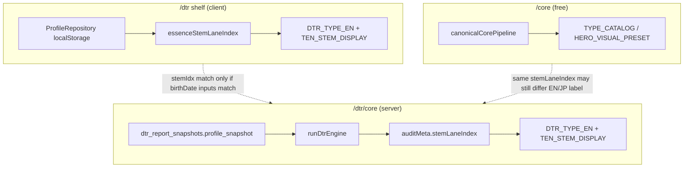

# Phase 5-6H-5Z-I-V-TL-FIX-A — Type-label mismatch fix planning gate（2026-05-21 SSOT）

## A. Gate summary

| Field | Value |
|-------|--------|
| **Phase** | **5Z-I-V-TL-FIX-A** |
| **Title** | **Type-label mismatch fix planning**（inventory + label SSOT + fix priority + next-gate proposal） |
| **Classification** | **Category 1 / docs-only / no-mutation** |
| **Verdict** | **`TYPE_LABEL_MISMATCH_FIX_PLANNING_GREEN_NO_MUTATION`** |
| **Evidence ID** | **`M55-EVID-20260521-5Z-I-V-TL-FIX-A-TYPE-LABEL-MISMATCH-FIX-PLAN-001`** |
| **Date** | **2026-05-21** |
| **Branch** | **`work/home-cluster`** |
| **Production domain** | **`m55-webv2.vercel.app`**（参照のみ；本 gate で UI 再観察なし） |
| **Prior handoff SSOT** | **`M55_PHASE5_6H_5Z_I_V_AS_E_LIMITED_CATEGORY_1_CONTINUATION_RELEASE_READINESS_HANDOFF_PLANNING_2026-05-19.md`** |
| **Prior TL chain** | **TL-A**（plan）→ **TL-A-R**（readonly result） |

**Execution in TL-FIX-A:** **none** — read-only repo inventory + planning record only。** **No** additional AS-B1-MONITOR poll；**no** Slack fixture retry。

---

## B. Current position（前提）

| Track | State |
|-------|--------|
| **Cadence anchor** | **5Z-I-V-AS-B1-MONITOR-CADENCE** — **継続**（本 gate で新規 poll なし） |
| **Notification runtime** | **`M55_OPS_NOTIFY_ENABLED=false`** — disabled |
| **Type-label** | **Open**（Category 3 / separate from AS close） |
| **DTR unlock** | **GREEN**（5Z-I-V-AC）— label fix は unlock ブロッカーではない |
| **Deploy / full dev flow** | **Unauthorized**（AS-E） |

---

## C. Contradiction verdict（矛盾有無）

| Layer | Contradiction? | Summary |
|-------|----------------|---------|
| **Entitlement / product_id / Stripe lane** | **No structural contradiction** | Single product **`DTR_CORE_STATIC_V1`** / right **`m55_p:core_origin`**；UI は複数表示名だが同一 SKU |
| **Ownership / gate / CTA routing** | **No contradiction** | **`resolveDtrShelfAccess`** と **`resolveEntryReportOwnership`** は整合（**5Z-I-U** / **TL-A-R**） |
| **Product display names（同一 SKU）** | **Partial UX contradiction** | **Entry Report** / **本質の読み解き** / **本質レポート** / **保存版** / **Full Report** が併存 — 別商品に見えうる |
| **Owned state vs artifact** | **No contradiction** | **保存済み** = 状態；**保存版** = 形式 — 役割は分離可能だが文言が近い |
| **Type source（/dtr vs /dtr/core）** | **Yes — functional contradiction** | 棚は **client `ProfileRepository`**、core は **`snapshot.profile` + `runDtrEngine`** — 入力ズレで **stemIdx / EN slug が不一致になりうる**（**5Z-I-S** 級） |
| **Type tables（/core free vs /dtr paid）** | **Yes — cross-surface divergence** | 同一 **`stemLaneIndex`** でも **free `/core`** は **`TYPE_CATALOG`**、**paid DTR** は **`DTR_TYPE_EN` + `TEN_STEM_DISPLAY`** — index 8 例：**INFLUENCER** vs **GLOBAL LEADER**（**5Z-I-U F-U-CORE-03**） |
| **M55 public expression policy** | **Partial risk** | EN slug（**GLOBAL LEADER** 等）が JP **`publicTitle`** と並列表示 — **ten-qualities** 方針と要すり合わせ |
| **Payment / fulfillment truth** | **No blocker** | Checkout metadata **`DTR_CORE_STATIC_V1`**；fulfillment と UI owned 表示はコード上一致 |

**Overall:** **矛盾あり** — 主因は **(1) type-source 入力分岐**、**(2) 商品名の多層ラベル**、**(3) free/paid 別 type 表**。** 決済・所有・gate ロジック自体は SSOT と矛盾しない。

---

## D. Display label inventory（表示揺れ一覧）

### D1. Product / SKU names（同一商品）

| Label | Locale | Surfaces | Source |
|-------|--------|----------|--------|
| **Entry Report** | EN | Shelf pill（unowned）；LP badge；`/dtr/core` metadata；My；catalog `title`；aria；processing eyebrow | `LABEL_ENTRY_REPORT`；`DtrShelfPanel`；`app/dtr/lp`；`myEntitlementLabels` |
| **Full Report** | EN | Shelf pill（**owned**）；`DtrFullReader` hero mono | `DtrShelfPanel` L138；`DtrFullReader` L658 |
| **本質の読み解き** | JP | LP `<title>` / H1（`STATIC_CTA.title`）；shelf card fallback title；catalog `subtitle` 前半 | `corePublicCopy`；`dtrProductCatalog` |
| **本質の読み解き（保存版）** | JP | Catalog subtitle 全文 | `dtrProductCatalog.ts` |
| **本質レポート** | JP | Reader sections；ConsultRoom；title rewrite | `DtrFullReader.tsx` |
| **本質の深読み** | JP | `/dtr` shelf H1 | `DtrShelfPanel` |
| **保存版** | JP | LP chip；shelf hints；processing copy | `app/dtr/lp`；`DtrProcessingClient` |
| **保存版レポート** | JP | Shelf intro；processing page | `DtrShelfPanel`；`app/dtr/processing` |
| **保存済み** | JP | Owned pill；hero badge；aria「保存済み。〜」 | `DtrShelfPanel`；`DtrFullReader`；`dtrShelfAccess` |
| **FULL REPORT**（観察用語） | EN | Human verification SSOT の観察ラベル（**UI は `Full Report`**） | Evidence docs only |

### D2. CTA / state labels

| State | `ownershipState` / `uxState` | Primary CTA | Notes |
|-------|------------------------------|-------------|-------|
| Anonymous | `anonymous` | **1,000円で入手する** → `/dtr/lp` | No **保存済み** |
| Unpaid signed-in | `locked` / `unpaid_locked` | **1,000円で入手する** | **AS-C6-W / AH** GREEN scope |
| Owned + snapshot ready | `owned` / `owned_snapshot_ready` | **レポートを開く** → `/dtr/core` | **保存済み** + **Full Report** pill |
| Owned + snapshot missing | `owned` / `owned_snapshot_not_ready` | **準備状況を確認する** → `/dtr/processing?recovery=owned` | Must not show purchase CTA（**dtrShelfAccess**） |
| Expired | `expired` | **サポートに相談する** | LP `?state=expired` |
| LP owned modes | `open` / `pending` / `recovery` | Hide price；recovery copy | `app/dtr/lp` |

### D3. Type / 資質 display（type source 分岐）

| Surface | Route | Type source | EN slug table | JP title |
|---------|-------|-------------|---------------|----------|
| **Paid shelf card** | `/dtr` | Client **`ProfileRepository.get(clerkId)`** → **`essenceStemLaneIndex(birthDate)`** | **`DTR_TYPE_EN[stemIdx]`** | **`TEN_STEM_DISPLAY[stemIdx].publicTitle`**（meta「タイプ」） |
| **Paid reader hero** | `/dtr/core` | Server **`runDtrEngine(snap.profile_snapshot)`** → **`auditMeta.stemLaneIndex`** | **`DTR_TYPE_EN[stemIdx]`** | Same **`TEN_STEM_DISPLAY`** via stem |
| **Free core hero** | `/core` | **`runCanonicalCorePipeline`** → **`typeIndexFromStemLane`** | **`TYPE_CATALOG` / `HERO_VISUAL_PRESET`** | **`coreLabel`**（関係洞察型 等）— **DTR 表と非同一** |
| **Engine payload title** | `/dtr/core` body | **`dtrEngine`** | **`Entry Report — {nick}さんの取り扱い説明書`** | Reader rewrites to **本質レポート —** |

**Branch diagram（planning）:**

---

## E. Impact scope（影響範囲）

| Tier | Files / routes | Change class |
|------|----------------|--------------|
| **P0 — type trust** | `components/dtr/DtrShelfPanel.tsx`；`app/dtr/page.tsx`（server props 拡張） | Unify owned shelf stem to **snapshot profile** |
| **P1 — product naming** | `lib/m55/myEntitlementLabels.ts`；`lib/m55/dtrProductCatalog.ts`；`DtrShelfPanel`；`DtrFullReader`；`app/dtr/lp`；`app/dtr/processing`；`dtrShelfAccess.ts` aria | Canonical label table 適用 |
| **P2 — reader copy** | `components/dtr/DtrFullReader.tsx`（title rewrite）；`lib/m55/dtrEngine.ts` payload title | **Entry Report** vs **本質レポート** 統一 |
| **P3 — free→paid continuity** | `components/core/corePublicCopy.ts`；`CoreEntryReportCTASection` | CTA 文言と paid primary name 一致 |
| **P4 — policy / EN slug** | `DtrShelfPanel`；`DtrFullReader` hero **表現傾向 /** row | Demote or remove primary **INFLUENCER** slug |
| **P5 — cross-surface type tables** | `lib/m55/coreResult/typeCatalog.ts` vs `DTR_TYPE_EN` | **Separate gate** — product decision（free vs paid 同一表にするか） |
| **Out of scope（本 fix 最小）** | Stripe Price metadata；DB migration；entitlement logic；`/home` freeze；storefront frozen pages |

**Regression surfaces:** owned/unowned CTA；**AS-C6** unpaid path；**AC** saved open path；consult/返書 labels（触る場合は AS-C2 整合）。

---

## F. Recommended unified labels（推奨統一 label）

**Canonical table（提案 — TL-FIX-B で SSOT 固定後に code 適用）:**

| Role | Recommended primary | Secondary / EN badge | Do not use as primary |
|------|---------------------|----------------------|------------------------|
| **Product name（JP）** | **本質の読み解き** | EN chip **Entry Report**（小） | **本質レポート** と **本質の深読み** を同一画面で併記しない |
| **Product name（EN）** | **Entry Report** | — | Rename product to **Full Report** |
| **Artifact format** | **保存版** | — | **保存版レポート** は冗長 — **保存版** に統一 |
| **Owned state** | **保存済み** | — | — |
| **Owned tier badge** | **Entry Report**（維持） | Optional subtle **保存版** | **Full Report** を商品名代替にしない |
| **Shelf section title** | **レポート** または **本質の読み解き** | Sub: **保存版の棚** | **本質の深読み**（棚 H1 だけ別名） |
| **CTA（unpaid）** | **1,000円で入手する** | — | 現状維持 |
| **CTA（owned ready）** | **レポートを開く** | aria: **保存済み。レポートを開く** | — |
| **Type JP** | **`TEN_STEM_DISPLAY.publicTitle`** | **10通りの資質** 文脈で説明 | 甲乙丙丁 / tree-mountain 生ラベル |
| **Type EN（hero）** | **非表示 or `lang="en"` 副次** | — | **GLOBAL LEADER** を JP 見出しと同格にしない |
| **Internal keys** | （非表示） | — | **`m55_p:core_origin`**、**`DTR_CORE_STATIC_V1`** |

---

## G. Fix priority（修正優先順位）

| ID | Severity | Class | Issue | Fix direction | Gate |
|----|----------|-------|-------|---------------|------|
| **TL-F1** | **high** | Type-source divergence | `/dtr` shelf vs `/dtr/core` 別入力 | Owned 時 server が **`profile_snapshot`** を棚に渡し client stem を上書き；unowned は現状 or generic | **TL-FIX-B** code |
| **TL-F2** | **medium** | UX clarity | **Full Report** vs **Entry Report** on owned | Owned でも product pill は **Entry Report**；**保存済み** のみ状態 | **TL-FIX-B** code |
| **TL-F3** | **medium** | UX clarity | **本質レポート** vs **本質の読み解き** in reader | Reader primary = **本質の読み解き**；**本質レポート** は section 内のみ or 廃止 | **TL-FIX-B** code |
| **TL-F4** | **medium** | Expression policy | EN slug primary in hero | 副次化 or 削除 | **TL-FIX-B** code |
| **TL-F5** | **low** | Cosmetic | **保存版レポート** duplication | **保存版** に短縮 | **TL-FIX-B** copy |
| **TL-F6** | **low** | Cosmetic | **本質の深読み** shelf H1 | **本質の読み解き** に寄せる or subtitle で説明 | **TL-FIX-B** copy |
| **TL-F7** | **medium–high** | Cross-surface | `/core` TYPE_CATALOG vs DTR ten-stem | Product decision：導線説明のみ統一 vs 表統合 | **Separate gate**（TL-FIX-C 候補）— スコープ大 |
| **TL-F8** | **low** | Docs | Human evidence **FULL REPORT** wording | SSOT 観察語を **Full Report** に揃える | Docs only |

**Not critical / not payment blocker:** **TL-F1** は UX trust；**AC unlock GREEN** は維持。

---

## H. SSOT / spec alignment check

| SSOT / policy | Alignment |
|---------------|-----------|
| **AS-E handoff** | Type-label **separate / open** — 本 gate はその fix plan |
| **M55_REPORT_SYSTEM / product structure** | **本質の読み解き** + 保存版 + 相談返書 — **推奨表と整合** |
| **POST_REVIEW / revenue SSOT** | 決済・entitlement 触らない fix — **allowed Category 2** |
| **ten-qualities public rule** | EN slug 主表示は **partial 違反リスク** — **TL-F4** で解消 |
| **TL-A-R checklist C10** | **no** — **TL-F1** で対応 |
| **DTR commerce freeze** | CTA 分岐・gate 変更は **最小 diff**；ownership ロジック変更なし |

---

## I. TL-FIX-B gate recommendation（次 Gate 案）

| Option | Gate | When | Rationale |
|--------|------|------|-----------|
| **Recommended** | **`5Z-I-V-TL-FIX-B`** — **implementation planning** | **Next** | **Category 2** 前に：ファイル別 diff 案・acceptance（C10 再検証・owned/unowned smoke 計画）・**canonical label table** の確定・Human GO チェックリスト。** まだ code を書かない。** |
| **Not yet** | **`TL-FIX-B-EXEC`**（implementation execution） | After **TL-FIX-B** + explicit Human GO | **Deploy unauthorized**（AS-E）；**auth compliance RED**；複数 surface 回帰 — planning なしの実行はリスク高 |
| **Defer** | **TL-FIX-B-EXEC** bundled with deploy | Only if Human bundles with **AS-C6** deploy | Label-only は単独 PR の方が review しやすい |

**Answer:** 次は **`TL-FIX-B` implementation planning** が妥当。** `TL-FIX-B` implementation execution** は Human GO・scope 固定・（必要なら）branch preview 検証計画の後。

**Optional before B-EXEC:** Fresh Human UI **`/dtr` vs `/dtr/core`** type line（redacted screenshots）— TL-A-R で deferred。

---

## J. No-mutation confirmation

| Check | Status |
|-------|--------|
| Code change | **no** |
| Copy change in app | **no** |
| Deploy / redeploy | **no** |
| main push | **no** |
| Production DB read/write | **no** |
| env change / env pull | **no** |
| Stripe / Clerk | **no** |
| Slack / fixture retry | **no** |
| repair runner / AX-PROD / AL | **no** |
| AS-B1 extra poll | **no**（cadence 継続のみ） |
| Raw ID / email / session / Stripe ID / secret | **no** |

**Verdict:** **`TYPE_LABEL_MISMATCH_FIX_PLANNING_GREEN_NO_MUTATION`**

---

## K. Prior evidence chain

| Phase | Evidence |
|-------|----------|
| **AS-E** | **`M55-EVID-20260519-5Z-I-V-AS-E-LIMITED-CATEGORY-1-CONTINUATION-RELEASE-READINESS-HANDOFF-PLAN-001`** |
| **TL-A** | **`M55-EVID-20260520-5Z-I-V-TL-A-TYPE-LABEL-MISMATCH-DIAGNOSTIC-PLAN-001`** |
| **TL-A-R** | **`M55-EVID-20260520-5Z-I-V-TL-A-R-TYPE-LABEL-MISMATCH-READONLY-DIAGNOSTIC-RESULT-001`** |
| **5Z-I-U** | **`M55-EVID-20260516-5Z-I-U-UI-UNLOCK-TYPE-MISMATCH-READONLY-DIAGNOSTIC-001`** |
| **本条** | **`M55-EVID-20260521-5Z-I-V-TL-FIX-A-TYPE-LABEL-MISMATCH-FIX-PLAN-001`** |

---

## Evidence Registry

| `evidence_id` | Role |
|----------------|------|
| **`M55-EVID-20260521-5Z-I-V-TL-FIX-A-TYPE-LABEL-MISMATCH-FIX-PLAN-001`** | **本条** |
