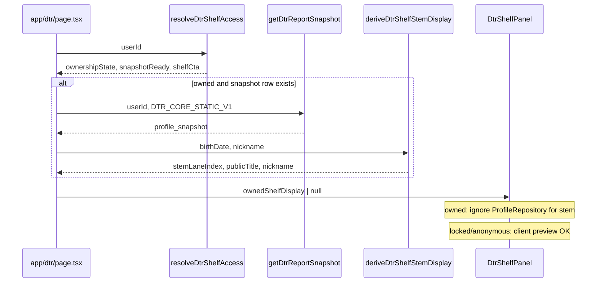

# Phase 5-6H-5Z-I-V-TL-FIX-B — Type-label mismatch implementation planning gate（2026-05-21 SSOT）

## A. Gate summary

| Field | Value |
|-------|--------|
| **Phase** | **5Z-I-V-TL-FIX-B** |
| **Title** | **Type-label mismatch implementation planning** |
| **Classification** | **Category 1 / implementation planning / docs-only / no-mutation** |
| **Verdict** | **`TYPE_LABEL_MISMATCH_IMPLEMENTATION_PLANNING_GREEN_NO_MUTATION`** |
| **Evidence ID** | **`M55-EVID-20260521-5Z-I-V-TL-FIX-B-TYPE-LABEL-MISMATCH-IMPLEMENTATION-PLAN-001`** |
| **Date** | **2026-05-21** |
| **Branch** | **`work/home-cluster`** |
| **Prior** | **TL-FIX-A** — **`M55-EVID-20260521-5Z-I-V-TL-FIX-A-TYPE-LABEL-MISMATCH-FIX-PLAN-001`** |

**Execution in TL-FIX-B:** **none** — diff 方針・acceptance・rollback・Human GO の確定のみ。

---

## B. Scope lock（本 gate で確定する判断）

| # | Topic | TL-FIX-B decision |
|---|--------|-------------------|
| **1** | Owned shelf type source | **Server `profile_snapshot.birthDate`** → **`essenceStemLaneIndex`**（**`runDtrEngine` と同一関数**）→ **`TEN_STEM_DISPLAY`**。**Client `ProfileRepository` は owned 時に type へ使わない。** |
| **2** | Server props | **`app/dtr/page.tsx`** が owned かつ snapshot 行あり時に **`ownedShelfDisplay`** を渡す（stemIdx + nickname + `publicTitle`）。**Gate ロジックは既存 `resolveDtrShelfAccess` のまま。** |
| **3** | Label unification | **`lib/m55/dtrProductLabels.ts`（新規）** に canonical 定数を集約し、対象 UI から import。 |
| **4** | **Full Report** | **UI から完全削除**（shelf pill・reader hero mono）。** |
| **5** | **本質レポート** | **ユーザー向け primary から廃止** → **本質の読み解き** に置換（reader / grounding / consult 帯の表示 copy のみ。**`dtrEngine` payload 内部 title 文字列は TL-FIX-C で任意** — 未変更でも `groundingDisplayReportTitle` で画面は統一可）。 |
| **6** | **本質の深読み** | **廃止** → shelf H1 を **本質の読み解き**（または **レポート** + lead で「保存版の棚」）。 |
| **7** | **保存版レポート** | **主要 pill / CTA / aria では「保存版」**；intro 本文 1 行は「保存版レポート」許容（説明文のみ）。 |
| **8** | **Entry Report on owned** | **補助化：owned 画面では EN pill 非表示。** JP **本質の読み解き** を product pill。**Unowned / LP / My / aria prefix** は **Entry Report** EN 補助を維持（Stripe・海外ユーザー慣行）。 |
| **9** | Type JP | **`TEN_STEM_DISPLAY[stemIdx].publicTitle` canonical**（meta「タイプ」・hero 主表示）。 |
| **10** | Type EN | **副次：DOM から削除 or `className` で視覚非表示 + `aria-hidden`**。JP **`publicTitle`** のみ主表示。 |
| **11** | **TL-F7** | **free `/core` vs paid DTR type 表統合** — **実装対象外**（別 gate）。 |

---

## C. Canonical label matrix

| Role | Canonical | Owned UI | Unowned UI | aria / metadata |
|------|-----------|----------|------------|-----------------|
| **JP 商品名** | **本質の読み解き** | Product pill；card title；reader brand；grounding | Card title；LP H1 | `本質の読み解き — …` |
| **EN 補助** | **Entry Report** | **非表示**（owned shelf / reader hero） | LP badge；catalog `title`；My | `Entry Report —`（unowned only） |
| **形式** | **保存版** | LP chip；intro | LP chip | — |
| **状態** | **保存済み** | Pill；hero badge | **出さない** | `保存済み。レポートを開く` 等 |
| **Type JP** | **`publicTitle`** | Meta「タイプ」；hero 主行 | 同（preview 時） | `資質：{publicTitle}` |
| **Type EN** | —（廃止 primary） | hidden | hidden or 副次のみ検討→**FIX-B は hidden** | — |
| **廃止** | **Full Report** | remove | — | — |
| **廃止 primary** | **本質レポート** | → 本質の読み解き | — | — |
| **廃止 H1** | **本質の深読み** | → 本質の読み解き | — | — |

**同一 SKU ルール:** 1 画面に **本質の読み解き** + **保存版** +（owned のみ）**保存済み** まで。**Entry Report** は unowned のみ。

---

## D. Type source 修正方針

### D1. Problem（再掲）

| Path | Today | After TL-FIX-C |
|------|-------|----------------|
| **`/dtr` owned card** | `ProfileRepository` (localStorage) | **`profile_snapshot`** from DB |
| **`/dtr/core` reader** | `runDtrEngine(snap.profile_snapshot)` | **unchanged** |
| **Index function** | Both use **`essenceStemLaneIndex`** when birthDate same | **Guaranteed match** |

### D2. Server data flow（提案）



### D3. New helper（提案ファイル）

**`lib/m55/dtrShelfStemDisplay.ts`**（新規・server-safe）

```ts
// Planning signature only — not implemented in TL-FIX-B
export type DtrShelfStemDisplay = {
  stemLaneIndex: number;
  publicTitle: string;   // TEN_STEM_DISPLAY[idx].publicTitle
  displayOneLine: string;
  nickname: string;
};

export function deriveDtrShelfStemDisplay(
  profile: { birthDate: string; nickname: string }
): DtrShelfStemDisplay;
```

- **Implementation:** `essenceStemLaneIndex(profile.birthDate)` + `TEN_STEM_DISPLAY[idx]`（**`runDtrEngine` L798 と同一**）。
- **Do not** call full `runDtrEngine` on shelf page（性能・不要）。

### D4. `app/dtr/page.tsx` props

| Prop | Type | When set |
|------|------|----------|
| `ownershipState` | existing | always |
| `snapshotReady` | existing | always |
| `shelfCta` | existing | always |
| **`ownedShelfDisplay`** | `DtrShelfStemDisplay \| null` | **`ownershipState === 'owned'`** かつ **`getDtrReportSnapshot` 成功** |
| | `null` | owned だが snap なし（準備中）→ card **generic**（**client stem 禁止**） |

**DB read:** `resolveDtrShelfAccess` 内で既に snap 参照あり → **TL-FIX-C で 1 回化**（access 返却に `ownedShelfDisplay` を含める）を推奨。**二重 SELECT 回避**。

### D5. `DtrShelfPanel.tsx` client rules

| Condition | Card profile source | Type EN row |
|-----------|---------------------|-------------|
| **`ownedShelfDisplay` present** | Server prop only | **非表示** |
| **owned, display null** | `{ kind: 'generic' }` | 非表示 |
| **locked / anonymous** | `ProfileRepository`（現状） | **非表示**（FIX-B：EN 削除） |
| **expired** | generic | 非表示 |

**Invariant:** **`owned && ownedShelfDisplay` → stemIdx === `/dtr/core` の `auditMeta.stemLaneIndex`**（同一 birthDate）。

---

## E. Implementation target files（実装対象）

| File | Change class | Summary |
|------|--------------|---------|
| **`lib/m55/dtrProductLabels.ts`** | **new** | `LABEL_PRODUCT_JP`, `LABEL_PRODUCT_EN`, `LABEL_FORMAT_SAVED`, `LABEL_STATE_OWNED`, aria builders |
| **`lib/m55/dtrShelfStemDisplay.ts`** | **new** | Server stem derivation from snapshot profile |
| **`lib/m55/dtrShelfAccess.ts`** | **display-only** | aria strings → JP product prefix；optional: return `ownedShelfDisplay` to dedupe DB read |
| **`app/dtr/page.tsx`** | **props** | Pass `ownedShelfDisplay`；or consume extended access |
| **`components/dtr/DtrShelfPanel.tsx`** | **logic + copy** | Props；owned stem lock；pills；H1；EN eyebrow remove |
| **`lib/m55/myEntitlementLabels.ts`** | **copy** | Re-export from `dtrProductLabels`；My は EN 維持可 |
| **`lib/m55/dtrProductCatalog.ts`** | **copy** | `title` / `subtitle` align canonical |
| **`app/dtr/lp/page.tsx`** | **copy** | Badges；owned recovery 文言（保存版レポート→保存版） |
| **`app/dtr/processing/page.tsx`** | **copy** | eyebrow → JP primary |
| **`components/dtr/DtrProcessingClient.tsx`** | **copy** | 保存版レポート→保存版（CTA 圏外） |
| **`components/dtr/DtrFullReader.tsx`** | **copy + hero** | Remove Full Report；JP type only；本質レポート→本質の読み解き；`groundingDisplayReportTitle` |
| **`app/dtr/core/page.tsx`** | **metadata** | `title: 本質の読み解き \| M55` |
| **`components/dtr/ConsultRoom.tsx`** | **copy**（最小） | 2 行 **本質レポート** → **本質の読み解き** |

**Estimated diff size:** ~350–500 LOC（mostly string + props；1–2 small libs）。

---

## F. Non-target files（実装対象外）

| Category | Paths | Reason |
|----------|-------|--------|
| **Frozen home** | `app/home/**`, `components/home/**` | **m55-home-no-touch** |
| **Storefront frozen** | `/`, `/dtr/lp` **決済・PurchaseButton ロジック** | label copy on LP **in scope**；**checkout route / webhook / price ID 触らない** |
| **Entitlement / payment** | `dtrOwnershipGate.ts`, `dtrCoreCheckoutFulfillment.ts`, `app/api/purchase/**`, `app/api/stripe/**`, `app/api/me/entitlements/**` | SSOT：ロジック不変 |
| **Engine body SSOT** | `lib/m55/dtrEngine.ts` section bodies | Optional title string later；**not required for acceptance** |
| **TL-F7** | `app/core/**`, `CoreHeroSection`, `typeCatalog.ts` | Separate gate |
| **Marketing surfaces** | `how-m55-works/**`, `M55TenViews`, `HomePanel`, `legal/**` | Out of band；別 copy ゲート |
| **Prototype** | `app/prototype/**` | Isolated |
| **Reply wallet duplicate** | `consultation-ticket-wallet.tsx` | Non-DTR shelf；defer |
| **E2E** | `e2e/*.spec.ts` | **TL-FIX-C** で `Full Report` 断言更新 |
| **CSS global / background** | html/body | NoTouch |
| **DB / env / Stripe / Clerk** | all | Forbidden |

---

## G. Proposed diff summary（TL-FIX-C 向け）

### G1. `dtrProductLabels.ts`（新規）

- Single canonical strings + `ariaLabelForDtrCta(mode, state)` helper.
- **No** runtime i18n framework — const only.

### G2. Type source（P0）

- Extend **`resolveDtrShelfAccess`** **or** page-level snap read → **`ownedShelfDisplay`**.
- **`DtrShelfPanel`:** `useMemo` branch — `if (ownershipState === 'owned')` use server prop; **never** `essenceStemLaneIndex(ProfileRepository)` when owned.

### G3. Shelf labels（P1）

- H1: **本質の読み解き**；lead: **保存版の棚です。…**
- Product pill: owned → **本質の読み解き**；unowned → **Entry Report**（EN 小）+ title **本質の読み解き**
- Remove **Full Report** branch (`isOwned ? 'Full Report' : 'Entry Report'` → canonical matrix).
- Remove **`分析類型 / {EN}`** row；meta **タイプ** = **`publicTitle`** only.

### G4. Reader（P1–P2）

- Hero brand: **M55 | 本質の読み解き**（replace Full Report mono).
- **`heroTypeCard`:** label **資質** or **表現傾向** + **`publicTitle`** only；remove EN span.
- **`groundingDisplayReportTitle`:** `本質の読み解き — {nick}さんの形を読み直す`.
- Replace user-visible **本質レポート** strings (~15 occurrences in `DtrFullReader` + `ConsultRoom`).

### G5. LP / processing / aria（P1）

- LP owned recovery: **保存版**（not 保存版レポート in CTA-adjacent lines).
- **`dtrShelfAccess`:** `ariaLabel: '本質の読み解き — 保存済み。レポートを開く'`（owned）；unowned keep **Entry Report — 入手する**.

### G6. Metadata

- **`/dtr/core`:** metadata title JP primary.

### G7. Explicitly NOT in diff

- `runDtrEngine` title template change（optional follow-up）.
- Stripe Dashboard product name.
- `/core` TYPE_CATALOG alignment.

---

## H. Acceptance criteria（TL-FIX-C 検証用）

| ID | Criterion | Pass test |
|----|-----------|-----------|
| **AC-TL-01** | Same SKU | One screen does not show **本質レポート** + **本質の深読み** + **Full Report** as competing product names |
| **AC-TL-02** | Owned product name | Owned shelf + reader hero use **本質の読み解き** as product pill / brand |
| **AC-TL-03** | Full Report gone | Grep UI bundle: **no `Full Report`** in `components/dtr/**`, `app/dtr/**` |
| **AC-TL-04** | 保存済み | Only on owned state pills / badges — not on unowned |
| **AC-TL-05** | 保存版 | Format chip / intro — not confused with 保存済み |
| **AC-TL-06** | Type JP match | Owned **`/dtr` meta タイプ** === **`/dtr/core` hero 資質/publicTitle**（同一 login） |
| **AC-TL-07** | No client override | Owned shelf type unchanged when localStorage birthDate tampered（server stem wins） |
| **AC-TL-08** | Gate unchanged | Unpaid still sees purchase CTA；owned ready → `/dtr/core`；owned !ready → processing recovery |
| **AC-TL-09** | No infra touch | No diff in `dtrOwnershipGate`, stripe routes, entitlements API behavior |
| **AC-TL-10** | TL-F7 excluded | No diff in `app/core/**` type tables |
| **AC-TL-11** | Entry Report | Present on LP unowned；**absent** on owned shelf pill |
| **AC-TL-12** | Type EN | No visible **GLOBAL LEADER**-style primary EN in DTR hero/shelf |

---

## I. Regression risks

| Risk | Severity | Mitigation |
|------|----------|------------|
| **Double DB read** on `/dtr` | low | Merge snap into `resolveDtrShelfAccess` return |
| **Owned !snapshotReady generic card** | low | Expected — copy says 準備中；no false type |
| **E2E asserts Full Report** | medium | Update in same TL-FIX-C PR |
| **aria regressions** | low | Spot-check VoiceOver labels |
| **My page still Entry Report** | low | Acceptable EN auxiliary per matrix |
| **Consult AI prompts** | none | `m55AiSafetyPolicy` / API routes **non-target** |
| **CSS layout shift** | low | Removing EN row may shorten card — acceptable |

---

## J. Manual UI verification（Human / TL-FIX-C）

| # | Steps | Expected |
|---|--------|----------|
| **M1** | Logged-out `/dtr` | No 保存済み；purchase CTA；no Full Report |
| **M2** | Unpaid signed-in `/dtr` | Same as M1 + **Entry Report** EN on unowned pill only |
| **M3** | Owned + ready: `/dtr` → `/dtr/core` | **タイプ/publicTitle** match；no Full Report；**本質の読み解き** brand |
| **M4** | Owned + !ready | 準備状況 CTA；no purchase；card generic or no type EN |
| **M5** | `/dtr/lp` owned recovery | No price block；保存版 wording |
| **M6** | localStorage birthDate change (owned) | Shelf type **unchanged** (server wins) |
| **M7** | `/core` free | **No regression required**（TL-F7 out） |

**No** checkout click；**no** Stripe；**no** DB write。

---

## K. Rollback policy

| Layer | Action |
|-------|--------|
| **Code** | Single revert commit / PR revert on `work/home-cluster` |
| **DB** | **None** — display-only |
| **env** | **None** |
| **Stripe** | **None** |
| **Deploy** | Rollback = previous deployment promote（別 Human GO） |
| **Feature flag** | **None planned** — small copy + props PR |

**Rollback trigger:** AC-TL-06/08 fail on branch preview；unpaid purchase CTA regression；owned open path broken.

---

## L. Human GO checklist（TL-FIX-C 実行前）

| # | Item | Owner |
|---|------|-------|
| **GO-01** | TL-FIX-B planning reviewed and accepted | Human |
| **GO-02** | Canonical label matrix accepted（§C） | Human |
| **GO-03** | **Entry Report hidden on owned** accepted | Human |
| **GO-04** | **TL-F7 deferred** — free/paid type table not in this PR | Human |
| **GO-05** | Category 2 code change authorized | Human |
| **GO-06** | **No** bundled deploy / env / DB / Stripe / Clerk | Human |
| **GO-07** | Branch preview URL for UI sign-off（optional） | Human |
| **GO-08** | E2E update included in same PR or waived | Human |
| **GO-09** | `/home` freeze respected — no home files in PR | Agent |
| **GO-10** | AS-B1-MONITOR cadence continues — no extra poll required for label PR | Agent |

**Without GO-01–GO-06:** do **not** start **TL-FIX-C**.

---

## M. Next gate recommendation

| Option | Gate | When |
|--------|------|------|
| **Recommended** | **`5Z-I-V-TL-FIX-C`** — **implementation execution** | After Human GO checklist **GO-01–GO-06** |
| **Optional** | **`5Z-I-V-TL-FIX-B-R`** — planning review result | Human wants formal sign-off doc before any code |
| **Not now** | Deploy to Production | Requires **AS-C6**-class deploy gate separately |
| **Deferred** | **TL-F7** | free `/core` ↔ paid DTR type table |

**Rationale:** TL-FIX-A + TL-A-R + TL-FIX-B already form a complete plan.** **B-R** adds value only for audit trail；default path is **TL-FIX-C** on branch with preview UI（M1–M7）.

---

## N. No-mutation statement

- **No** code / copy change in app
- **No** deploy / redeploy / main push
- **No** Production DB / env / Stripe / Clerk / Slack / fixture / repair / AX-PROD / AL
- **No** full normal dev flow release
- **No** raw user_id / email / session / Stripe ID / secret

**Verdict:** **`TYPE_LABEL_MISMATCH_IMPLEMENTATION_PLANNING_GREEN_NO_MUTATION`**

---

## Evidence Registry

| `evidence_id` | Role |
|----------------|------|
| **`M55-EVID-20260521-5Z-I-V-TL-FIX-B-TYPE-LABEL-MISMATCH-IMPLEMENTATION-PLAN-001`** | **本条** |
| **`M55-EVID-20260521-5Z-I-V-TL-FIX-A-TYPE-LABEL-MISMATCH-FIX-PLAN-001`** | Prior inventory |
