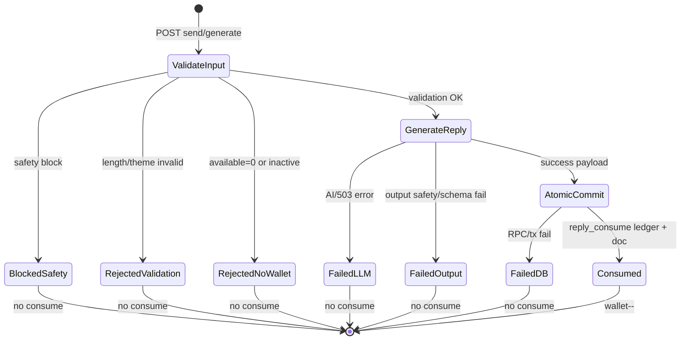

# Phase BACKEND-COMMERCE-CONTRACT-A — ¥1,000 DTR + ¥500 reply ticket commerce contract planning（2026-05-23）

## A. Gate summary

| Field | Value |
|-------|--------|
| **Phase** | **BACKEND-COMMERCE-CONTRACT-A** |
| **Title** | **Backend / commerce contract — ¥1,000 saved report + ¥500 additional reply ticket simultaneous release** |
| **Classification** | **Category 1 / read-only repo + SSOT audit / planning only / no-mutation** |
| **Verdict** | **`BACKEND_COMMERCE_CONTRACT_A_1000_DTR_AND_500_REPLY_TICKET_PLANNING_GREEN_NO_MUTATION`** |
| **Evidence ID** | **`M55-EVID-20260523-BACKEND-COMMERCE-CONTRACT-A-1000-DTR-500-REPLY-PLANNING-001`** |
| **Date** | **2026-05-23** |
| **Deploy anchor** | **`main`** @ **`6ce7002`** · Production synced |
| **Policy decision** | **¥500 additional reply included in first release** — not deferred |
| **UI second pass** | **paused** — next durable work is this contract track |
| **VERIFY-C** | **HOLD** |
| **R8-R meta commit** | **not created** |
| **Meta-record chain** | **CLOSED** |

**Planning only.** No code · Stripe · env · DB · webhook replay · live checkout · commit.

---

## B. Pre-check

| # | Check | Result |
|---|-------|--------|
| 1 | `git status --short` | **`M55_SYSTEM_SSOT.md` modified** · untracked SSOT ×6 · `supabase/.temp/` |
| 2 | `supabase/.temp/` staged | **no** |
| 3 | `.vercel/` · `.cursor-preview-cache/` staged | **no** |
| 4 | R8-R meta commit | **no** |
| 5 | push / deploy | **no** |
| 6 | DB / env / payment / webhook / VERIFY-C | **no** |

---

## C. Inspected files（read-only）

### API routes

| Path | Role |
|------|------|
| `app/api/purchase/checkout/route.ts` | DTR ¥1,000 Checkout Session create |
| `app/api/reply-tickets/checkout/route.ts` | ¥500 additional reply Checkout |
| `app/api/stripe/webhook/route.ts` | Stripe webhook router · DTR + reply lanes |
| `app/api/reply/generate/route.ts` | Alternate reply commit via `m55_reply_generate_commit` RPC |
| `app/api/room/core/route.ts` | Consult room state · wallet probe · thread reconcile |
| `app/api/room/core/send/route.ts` | **Live** consult send · wallet consume |
| `app/api/me/entitlements/route.ts` | Client entitlement read |

### lib / fulfillment

| Path | Role |
|------|------|
| `lib/m55/dtrCoreCheckoutFulfillment.ts` | DTR one-time fulfillment SSOT |
| `lib/m55/dtrCheckoutRepurchaseLane.ts` | Hidden-snapshot repurchase gate |
| `lib/m55/reply/replyTicketCheckoutConstants.ts` | **5-cap** · SKU · metadata keys |
| `lib/m55/reply/replyTicketCheckoutValidate.ts` | ¥500 checkout pre-gates |
| `lib/m55/reply/replyTicketWebhookLane.ts` | Webhook reply lane delegate |
| `lib/m55/reply/replyTicketFulfillmentRpc.ts` | RPC caller |
| `lib/m55/reply/walletGrants.ts` | Included grant on DTR fulfill |
| `lib/oneTimeCheckout.ts` | `DTR_CORE_STATIC_V1` allowlist |

### UI（contract consumers）

| Path | Role |
|------|------|
| `components/dtr/ConsultRoom.tsx` | **Live** room · `/api/room/core*` · `/api/reply-tickets/checkout` |
| `components/dtr/DtrFullReader.tsx` | Owned reader · consult embed |
| `lib/m55/dtrOwnershipGate.ts` | Ownership fail-closed |

### DB / SQL / SSOT

| Path | Role |
|------|------|
| `supabase/migrations/20260416000000_reply_system_data_layer_v1.sql` | Wallet · ledger · sessions schema |
| `supabase/migrations/20260417000000_m55_reply_generate_commit_rpc.sql` | Atomic consume RPC |
| `scripts/sql/staging/m55_reply_ticket_fulfillment_rpc_candidate.sql` | ¥500 fulfill RPC design |
| `scripts/sql/production/m55_phase5_2_reply_ticket_fulfillment_production_migration_candidate_v1.sql` | Production migration candidate |
| `docs/ssot/M55_REPLY_TICKET_CHECKOUT_WEBHOOK_API_CONTRACT_DESIGN_v1.md` | ¥500 API contract |
| `docs/ssot/M55_REPLY_DATA_MODEL_AND_DB_CONTRACT_v1.md` | Data model reference |
| `docs/ssot/M55_REPLY_TICKET_PHASE_IV_RPC_PRODUCTION_APPLY_RESULT_v1.md` | RPC production apply history |

---

## D. Current implementation map

```
┌─────────────────────────────────────────────────────────────────────────┐
│ PUBLIC / PURCHASER FLOW @ 6ce7002                                       │
├─────────────────────────────────────────────────────────────────────────┤
│ ¥1,000 DTR                                                              │
│   POST /api/purchase/checkout  →  Stripe Checkout (STRIPE_PRICE_DTR_*)  │
│   success → /dtr/processing?session_id=                                 │
│   webhook checkout.session.completed → fulfillDtrCoreFromCheckoutSession│
│     → one_time_fulfillments · entitlements · entitlement_rights         │
│     → dtr_report_snapshots · grantInitialIncludedReplyIfNeeded          │
│     → wallet.report_instance_id link                                    │
├─────────────────────────────────────────────────────────────────────────┤
│ ¥500 additional reply                                                   │
│   POST /api/reply-tickets/checkout  →  Stripe (STRIPE_PRICE_ADDITIONAL│
│   success → /dtr/core?checkout=complete                                 │
│   webhook branch → m55_reply_ticket_fulfill_checkout_event RPC          │
│     → wallet purchased_count++ · purchase_grant ledger                  │
├─────────────────────────────────────────────────────────────────────────┤
│ Reply consumption (LIVE UI = ConsultRoom)                               │
│   POST /api/room/core/send  →  AI → consult_messages insert             │
│     → reply_ticket_wallets optimistic update (NO ledger row today)      │
│   (Alternate, not ConsultRoom) POST /api/reply/generate                 │
│     → m55_reply_generate_commit RPC (ledger reply_consume)              │
└─────────────────────────────────────────────────────────────────────────┘
```

**Parallel legacy layer:** `consult_threads` (`credits_total` / `credits_remaining`, **MAX=3** in route + UI) coexists with **`reply_ticket_wallets` SSOT (cap **5**)**.

---

## E. ¥1,000 DTR product contract table

| Contract field | Current implementation | Idempotency / duplicate prevention |
|----------------|------------------------|-----------------------------------|
| **product_id** | **`DTR_CORE_STATIC_V1`** (`lib/oneTimeCheckout.ts`) | Webhook allowlist `ALLOWED_ONE_TIME_PRODUCTS` |
| **Display price** | UI **¥1,000** · env **`STRIPE_PRICE_DTR_CORE_STATIC_V1`** | Price ID not in repo |
| **Checkout API** | **`POST /api/purchase/checkout`** `{ productId }` | 409 `already_purchased` · `fulfillment_pending` |
| **Profile gate** | `validateDtrCheckoutProfile` + draft merge | 400 `composite_profile_incomplete` |
| **Repurchase lane** | Hidden snapshot only (`dtrCheckoutRepurchaseLane`) | Visible snapshot → block |
| **Stripe metadata** | `productId` + profile v2 fields | Snapshot from metadata at fulfill |
| **client_reference_id** | Clerk **`userId`** | Missing → `failed_fulfillments` · ops notify |
| **Webhook event** | **`checkout.session.completed`** mode=payment | **`stripe_events.event_id`** dedupe |
| **Fulfillment fn** | **`fulfillDtrCoreFromCheckoutSessionId`** | **`one_time_fulfillments.checkout_session_id`** |
| **entitlements** | upsert active · `grant_type=one_time` | `(user_id, product_id)` conflict |
| **entitlement_rights** | **`m55_p:core_origin`** | upsert onConflict |
| **dtr_report_snapshots** | `upsertDtrReportSnapshotAtFulfillment` | visible partial unique index (R8 stable) |
| **Included reply** | **`grantInitialIncludedReplyIfNeeded`** → wallet + **`included_grant` ledger** | `initial_included_count > 0` skip |
| **Wallet link** | update wallet **`report_instance_id`** post snapshot | active wallet only |
| **Processing fallback** | `/dtr/processing` can call same fulfill fn | Same idempotency |
| **Refund** | **`charge.refunded` full** → revoke entitlement + delete right | Partial refund keeps access |
| **Failure store** | **`failed_fulfillments`** + 500 retry on internal fail | R8: **7 historical / 24h 0** |

---

## F. ¥500 reply-ticket product contract table

| Contract field | Current implementation | Idempotency / duplicate prevention |
|----------------|------------------------|-----------------------------------|
| **product_key** | **`additional_reply_ticket`** | Checkout + webhook metadata guard |
| **Display price** | UI **¥500** · env **`STRIPE_PRICE_ADDITIONAL_REPLY_TICKET`** | Not in repo |
| **Checkout API** | **`POST /api/reply-tickets/checkout`** | Errors: `cap_reached` · `forbidden_not_owner` · etc. |
| **Eligibility** | Visible **`dtr_report_snapshots`** owned by user | `verifyUserOwnsReportInstance` |
| **Room binding** | **`report_instance_id`** in metadata + wallet scope | Per-report wallet row |
| **Cap policy** | **Included 1 + purchased max 4 = total 5** | `REPLY_TICKET_*` constants |
| **Quantity** | **1 per checkout** | RPC rejects `quantity != 1` |
| **Stripe metadata** | `product_key` · `report_instance_id` · `user_ref_hash` · `quantity` | No PII body in metadata |
| **Webhook** | Reply branch before DTR lane | Same **`stripe_events`** global dedupe |
| **Fulfillment** | RPC **`m55_reply_ticket_fulfill_checkout_event`** | **`stripe_processed_events.stripe_event_id`** |
| **Wallet increment** | `purchased_count++` · `available_count++` | Cap check in RPC → `skipped_cap` |
| **Ledger** | **`purchase_grant`** · source **`PURCHASE`** | Duplicate → `duplicate_noop` |
| **Refund / revoke** | **Not implemented** in webhook for reply SKU | **GAP** — contract TBD |
| **Live checkout** | UI wired in **`ConsultRoom`** | **HOLD** until contract B+ gates |

---

## G. Reply consumption state machine（target contract）



**Current vs target:**

| Stage | Target | **`/api/reply/generate`** | **`/api/room/core/send` (LIVE)** |
|-------|--------|---------------------------|-------------------------------------|
| Safety block → no consume | **required** | **yes** | **yes** |
| Validation fail → no consume | **required** | **yes** | **yes** |
| LLM fail → no consume | **required** | N/A (stub/LLM path) | **yes** |
| Consume only on successful commit | **required** | **yes** (RPC) | **partial** — messages may persist if consume fails |
| **`reply_consume` ledger** | **required** | **yes** | **no** |
| **Idempotency key** | **required** | **`X-Idempotency-Key`** | **none** |
| **Double-submit guard** | **required** | session idempotency | client `sendLock` only |

---

## H. Wallet / ledger state machine

| State | Fields | Entry | Exit |
|-------|--------|-------|------|
| **no_wallet** | — | pre-DTR purchase | DTR fulfill **`included_grant`** |
| **active_with_balance** | `available_count > 0` | grant / purchase | **`reply_consume`** |
| **active_empty** | `available_count = 0` | last consume | purchase grant if under cap |
| **cap_reached** | `initial + purchased >= 5` | 4th purchase grant | admin/recovery only |
| **suspended/closed** | `status != active` | ops quarantine | recovery gate |

**Ledger event types (DB CHECK):** `included_grant` · `purchase_grant` · **`reply_consume`** · `recovery_adjust` · `admin_adjust`

**Invariant:** `available_count = initial_included_count + purchased_count - consumed_count`

---

## I. Purchased room state contract

| User-visible concern | SSOT source | Can purchase ¥500 | Can send reply | Block reason (user copy) |
|----------------------|-------------|-------------------|----------------|--------------------------|
| Not owned | `dtrOwnershipGate` | **no** | **no** | redirect LP |
| Owned · snapshot pending | entitlement + no snapshot | **no** | **no** | processing / 準備中 |
| Owned · snapshot ready · wallet active · avail > 0 | wallet | **yes** if `purchased < 4` | **yes** | — |
| Owned · avail = 0 · under cap | wallet | **yes** | **no** | 残り0 · add-on CTA |
| Owned · cap reached | wallet totals | **no** | **no** | 上限到達 |
| Wallet missing | no row for report | **no** | **no** | reload / support |
| Thread read_only | legacy `consult_threads` | defers to wallet for checkout | **no** if effective 0 | SSOT mismatch risk |

**Stale refresh:** `GET /api/room/core` reconciles thread from message count · exposes **`effective_credits_remaining`** from wallet when present · logs **`LEDGER_MISMATCH_PROBE`**.

**UI contract drift (known):** ConsultRoom shows **合計5件** but thread constants **`MAX_CREDITS=3`** — must align in implementation gate.

---

## J. Support / manual repair runbook boundaries

| Scenario | Read-only diagnosis | Automated retry | Manual repair allowed | Out of scope |
|----------|---------------------|-----------------|----------------------|--------------|
| **Paid ¥1,000 · not unlocked** | `one_time_fulfillments` · `entitlements` · `failed_fulfillments` · Stripe session paid | `/dtr/processing` re-invoke fulfill | **`recovery_adjust` ledger** · re-run fulfill with ops GO | ad-hoc entitlement without event |
| **Unlocked · not visible** | `dtr_report_snapshots` visible/hidden · profile metadata | revalidate paths | snapshot regen with ops GO | Production delete batch |
| **Paid ¥500 · wallet not incremented** | `stripe_processed_events` · RPC status · `failed_fulfillments` | Stripe webhook replay **HOLD** | **`purchase_grant` recovery** with event proof | blind +1 without payment |
| **Wallet incremented · UI hidden** | wallet row · `report_instance_id` scope | refresh `/api/room/core` | fix scope link | — |
| **Reply consumed · no message** | consult_messages count vs wallet | — | **`recovery_adjust`** + message audit | fake AI content |
| **Duplicate checkout** | duplicate session ids · webhook dedupe | idempotent noop | refund decision Human | double manual grant |
| **Duplicate webhook** | `stripe_events` · `stripe_processed_events` | 200 noop | none if grants consistent | — |
| **Refund ¥1,000** | `charge.refunded` full | auto revoke in code | partial = keep access policy | — |
| **Refund ¥500** | **no auto handler** | **GAP** | Human policy + manual ledger | auto revoke undefined |

**Support must never paste:** raw user_id · email · session · Stripe IDs in tickets (counts-only / safe labels only).

---

## K. Gap list

| ID | Area | Gap | Severity |
|----|------|-----|----------|
| **BC-GAP-001** | Consumption | **`/api/room/core/send`** consumes wallet **without `reply_consume` ledger** | **P0** |
| **BC-GAP-002** | Consumption | Message insert **before** wallet consume → orphan messages on consume fail | **P0** |
| **BC-GAP-003** | State | **`consult_threads` cap 3** vs wallet cap **5** · dual SSOT | **P0** |
| **BC-GAP-004** | Architecture | Two consumption paths (`room/send` vs `reply/generate`) — live UI uses non-ledger path | **P0** |
| **BC-GAP-005** | RPC scope | **`m55_reply_generate_commit`** wallet lookup **`user_id` only** — report_instance scope unclear vs production wallet migration | **P1** |
| **BC-GAP-006** | Refund | **No ¥500 refund / revoke** webhook lane | **P1** |
| **BC-GAP-007** | Env | **`STRIPE_PRICE_ADDITIONAL_REPLY_TICKET`** presence not verified in this gate | **P1** |
| **BC-GAP-008** | Production DB | **`report_instance_id`** on wallets / **`stripe_processed_events`** — production schema assumed from scripts; not re-verified here | **P1** |
| **BC-GAP-009** | UI copy | Wallet **5 vs 3** display inconsistency (Category 1 second pass item) | **P2** |
| **BC-GAP-010** | WEB_PRICING SSOT | Legacy **`WEB_PRICING_WALLET_SEPARATION_SSOT_v1`** prices SKUs differ from live **`DTR_CORE_STATIC_V1`** | **doc supersede** |

---

## L. P0 blockers（before live ¥500 + unified release）

| ID | Blocker | Contract fix direction |
|----|---------|------------------------|
| **BC-P0-001** | Single consumption authority | Route **`/api/room/core/send`** through **atomic RPC** (extend `m55_reply_generate_commit` or new **`m55_consult_reply_commit`**) with **`reply_consume` ledger** |
| **BC-P0-002** | Transaction boundary | **Consume only after** both messages persisted · or full rollback |
| **BC-P0-003** | Cap alignment | Deprecate **`consult_threads.credits_*`** as authority · UI + API use **wallet SSOT only** (5 cap) |
| **BC-P0-004** | Idempotency | **`send` idempotency key** (client header + server dedupe) |
| **BC-P0-005** | Release verification gate | **`BACKEND-COMMERCE-CONTRACT-B`** env + RPC + schema preflight (read-only SQL) before any live checkout |

---

## M. P1 before-release

| ID | Item |
|----|------|
| **BC-P1-001** | Confirm Production **`m55_reply_ticket_fulfill_checkout_event`** + **`stripe_processed_events`** applied |
| **BC-P1-002** | Confirm **`STRIPE_PRICE_DTR_CORE_STATIC_V1`** + **`STRIPE_PRICE_ADDITIONAL_REPLY_TICKET`** live · **¥1000/¥500** |
| **BC-P1-003** | Webhook reply lane end-to-end test plan (shadow / test mode — not this gate) |
| **BC-P1-004** | Define **¥500 refund** policy + whether webhook handler needed |
| **BC-P1-005** | Support runbook SSOT one-pager from §J |
| **BC-P1-006** | Purchased-room API contract doc: **`GET /api/room/core`** field stability |

---

## N. After-release

| ID | Item |
|----|------|
| **BC-AR-001** | Category 1 UI second pass (wallet copy alignment) — **after** contract B |
| **BC-AR-002** | Migrate fully off **`consult_threads`** ledger if retained for messages only |
| **BC-AR-003** | Ops monitor cadence for **`failed_fulfillments_24h`** post-commerce launch |
| **BC-AR-004** | VERIFY-C track — separate Human GO |

---

## O. Proposed execution sequence

| Step | Gate | Scope |
|------|------|-------|
| **1** | **`BACKEND-COMMERCE-CONTRACT-A-COMMIT`** | Optional · stage this planning SSOT |
| **2** | **`BACKEND-COMMERCE-CONTRACT-B`** | Schema/env/RPC **read-only preflight** · contract tables frozen |
| **3** | **`BACKEND-COMMERCE-CONTRACT-C`** | Implement P0: unified consume RPC · ledger · cap · idempotency |
| **4** | **`BACKEND-COMMERCE-CONTRACT-D`** | Staging/test-mode checkout + webhook observation (**no Production live pay**) |
| **5** | **`BACKEND-COMMERCE-CONTRACT-E`** | Production deploy planning + ops monitor |
| **6** | **`BACKEND-COMMERCE-CONTRACT-F`** | Human GO live checkout smoke (single SKU each) |
| **—** | **`CATEGORY-1-UI-POLISH-SECOND-PASS-*`** | **After** commerce contract C+ (wallet copy depends on SSOT) |

---

## P. Acceptance criteria for simultaneous release

| # | Criterion |
|---|-----------|
| 1 | **¥1,000** purchase → entitlement + visible snapshot + **included_grant** wallet **1** · ledger row |
| 2 | **¥500** purchase → **`purchase_grant`** +1 · cap enforced at **5 total** · duplicate webhook **noop** |
| 3 | Reply send success → **`reply_consume` ledger** · wallet-- · **no consume** on safety/validation/AI/DB fail |
| 4 | Double-submit same idempotency → **single consume** |
| 5 | **`GET /api/room/core`** reflects wallet SSOT · no thread/wallet mismatch without probe warn |
| 6 | Support runbook covers §J scenarios with **safe labels only** |
| 7 | **VERIFY-C HOLD** until separate authorization |
| 8 | **OPS-MONITOR** post-deploy counts stable (R8-R baseline) |

---

## Q. No-mutation（this gate）

| Action | Status |
|--------|--------|
| code edit | **no** |
| commit | **no** |
| push / deploy | **no** |
| DB write / env change | **no** |
| live checkout / payment / webhook replay | **no** |
| Stripe product/price mutation | **no** |
| VERIFY-C | **HOLD** |
| Production delete | **no** |
| raw ID / secret | **no** |
| R8-R meta commit | **no** |

---

## R. Recommended next gate

**`BACKEND-COMMERCE-CONTRACT-B`** — read-only Production preflight (RPC exists · wallet schema · price env names · no live payment)

---

## S. Evidence Registry

| `evidence_id` | Role |
|----------------|------|
| **`M55-EVID-20260523-BACKEND-COMMERCE-CONTRACT-A-1000-DTR-500-REPLY-PLANNING-001`** | **本条** |
| **`M55-EVID-20260522-CATEGORY-1-UI-POLISH-D-EXEC-001`** | Deploy anchor |
| **`M55-EVID-20260522-5Z-I-V-RELEASE-READINESS-OPS-MONITOR-R8-R-001`** | Cadence anchor (Human · docs uncommitted OK) |
